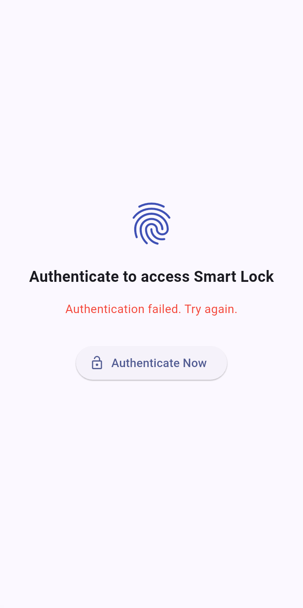
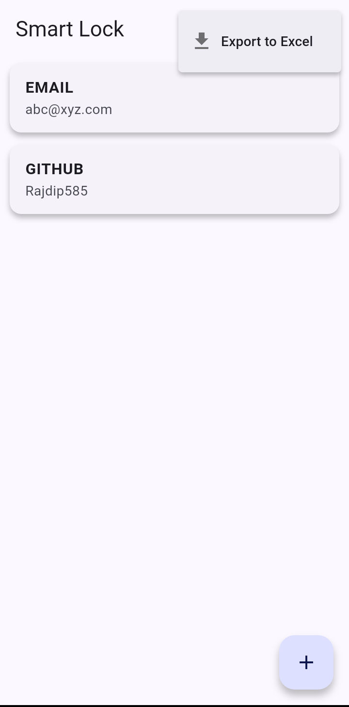
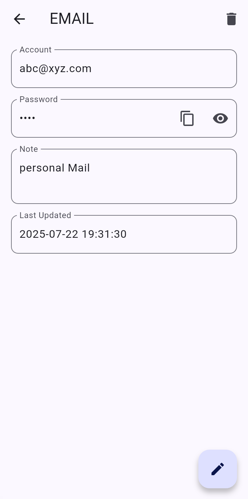

# 🔐 Flutter Password Manager

A secure, offline password manager built with **Flutter**, designed to help you store, manage, and export your credentials with ease. Simple, fast, and fully private — your data stays on your device.

---

## ✨ Features

- 📥 **Save Passwords** with platform, account, password, and optional notes
- ✏️ **Edit Entries** in a smooth UI with toggle between read and edit mode
- 👁️ **Show/Hide Password** toggle for security
- 📄 **Optional Notes Field** with clean formatting and dynamic updates
- 🕒 **Last Updated Timestamp** for every entry
- 🧾 **Export to Excel (.xlsx)** for backup or offline viewing
- 🗑️ **Delete Entries** with confirmation dialog
- 📋 **Copy Password to Clipboard** with one tap
- 🎯 **Responsive UI** with modern input animations and label transitions

---

## 📱 Screenshots

| Entry  | Home  | View |
|-----------|------------|-----------------|
|  |  |  |

---

## 📦 Tech Stack

- **Flutter** – Cross-platform UI toolkit
- **Dart** – Core programming language
- **SQLite** – Local secure storage using `sqflite` package
- **Intl** – For human-readable date formatting
- **excel** – For generating Excel (.xlsx) files for data export

---

## 📁 Project Structure

```
lib/
├── db/
│   └── password_database.dart         # All DB interactions (insert, update, delete, fetch)
├── models/
│   └── password_entry.dart            # Data class for password Entry
├── screens/
│   ├── add_password_screen.dart       # Form to add new passwords
│   ├── home_screen.dart      # View & edit existing passwords
│   └── view_password_screen.dart             # Export logic & file download
├── utils/
│   └── excel_exporter.dart            # Helper to generate .xlsx files
└── main.dart                          # App entry point
```

---

## 🚀 Getting Started

### Prerequisites

- Flutter SDK (Latest stable)
- Android Studio / VS Code
- Emulator or physical device

### Installation


```bash
git clone https://github.com/Rajdip585/password_manage_flutter.git
cd flutter-password-manager
```
```
flutter pub get
```
```
flutter run
```
## 🧑‍💻 Usage

- Tap the **Add New** button to store new credentials  
- Toggle fields between read-only and editable using the **FAB**  
- Tap the **Export** button from the menu to generate an `.xlsx` file in the device's Downloads folder  
- All data is stored locally in a secure SQLite database  

---

## 📤 Export to Excel

- Go to the **Export** section in the app  
- Tap on **"Export to Excel"**  
- The file will be saved as `passwords_export.xlsx` in your device’s storage  
- Each row contains **Platform**, **Account**, **Password**, **Note**, and **Last Updated** timestamp  

⚠️ **Ensure storage permission is granted for file access.**

---

## 🛡️ Privacy

This application is completely **offline**.  
No data is stored on cloud servers.  
Your passwords **never leave your device**.
